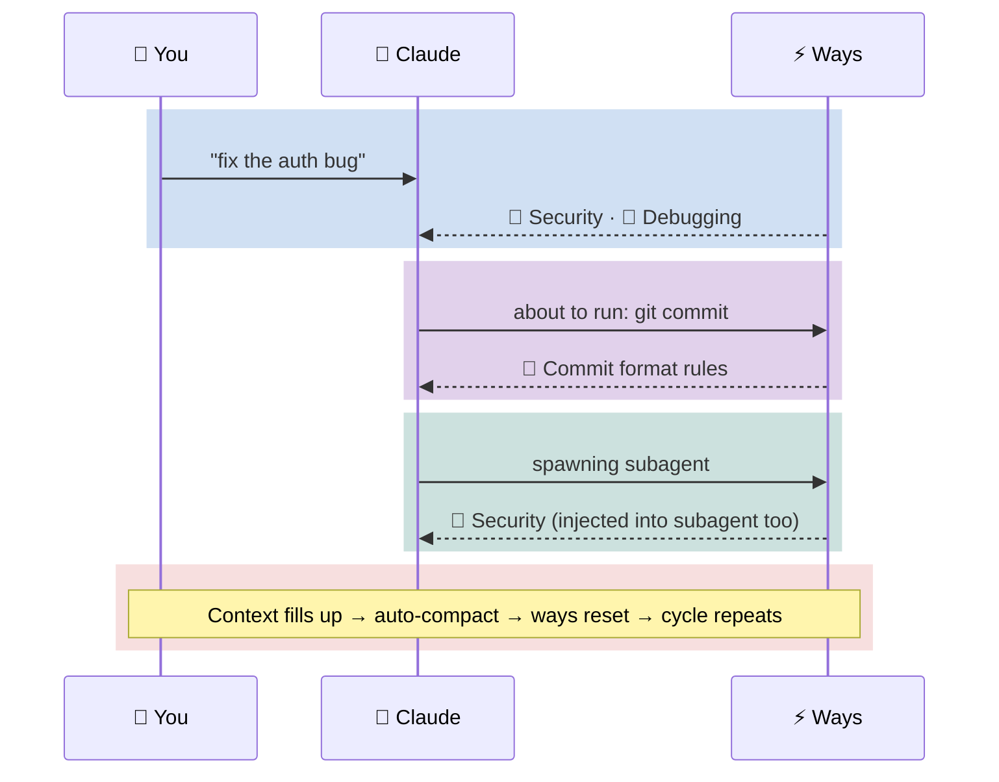

# Claude Code Config


<sub>Fresh context. Injected guidance. Structured coordination. No memory of previous sessions.<br/>The parallels are entirely coincidental.</sub>

---

Event-driven policy, process, and governance for Claude Code. Ways encode *how we do things* — prescriptive rules triggered by context, not requested by intent — and inject them just-in-time before tools execute.



**Ways** = policy and process encoded as contextual guidance. Triggered by keywords, commands, and file patterns — they fire once per session, before tools execute, and carry into subagents.

**Why this works:** System prompt adherence decays as a power law over conversation turns — instructions at position zero lose influence as context grows. Ways sidestep this by injecting small, relevant guidance near the attention cursor at the moment it matters, maintaining steady-state adherence instead of a damped sawtooth. It's [progressive disclosure](docs/hooks-and-ways/context-decay.md) applied to the model itself.

This repo ships with software development ways, but the mechanism is general-purpose. You could have ways for:
- Excel/Office productivity
- AWS operations
- Financial analysis
- Research workflows
- Anything with patterns Claude should know about

## Prerequisites

Runs on **Linux** and **macOS**. The hooks are all bash and lean on standard POSIX utilities plus a few extras:

| Tool | Purpose | Notes |
|------|---------|-------|
| [Claude Code](https://docs.anthropic.com/en/docs/claude-code) | The agent this configures | `npm install -g @anthropic-ai/claude-code` |
| `git` | Version control, update checking | Usually pre-installed |
| `jq` | JSON parsing (hook inputs, configs, API responses) | **Must install** |
| `cc` | Build BM25 matcher from source (`make local`) | Usually pre-installed; see below |
| `gzip` | Legacy NCD fallback (only if BM25 binary missing) | Usually pre-installed |
| `bc` | Math for legacy NCD fallback | Usually pre-installed (not in Arch `base`) |
| `python3` | Governance traceability tooling | Stdlib only — no pip packages |
| [`gh`](https://cli.github.com/) | GitHub API (update checks, repo macros) | Recommended, not required — degrades gracefully |

Standard utilities (`bash`, `awk`, `sed`, `grep`, `find`, `timeout`, `tr`, `sort`, `wc`, `date`) are assumed present via coreutils.

**BM25 semantic matcher:** The matching engine is a C binary at `bin/way-match` (source in `tools/way-match/`), checked into the repo as a cross-platform binary. To rebuild from source: `make local` (uses system `cc`) or `make` (uses [Cosmopolitan](https://cosmo.zip/)). If the binary is missing, matching falls back to a legacy gzip NCD script, then regex only.

**Platform install guides:**
[macOS (Homebrew)](docs/prerequisites-macos.md) · [Arch Linux](docs/prerequisites-arch.md) · [Debian / Ubuntu](docs/prerequisites-debian.md) · [Fedora / RHEL](docs/prerequisites-fedora.md)

> **macOS note:** `timeout` is a GNU coreutils command not present by default. Install `coreutils` via Homebrew — see the [macOS guide](docs/prerequisites-macos.md) for PATH setup.

## Quick Start

**Fork first.** This repo is a starting point — you'll want to add your own ways for your own workflows. Fork it, then clone your fork:

```bash
# Backup existing config if any
[ -d ~/.claude ] && mv ~/.claude ~/.claude-backup-$(date +%Y%m%d)

# Clone your fork
git clone https://github.com/YOUR-USERNAME/claude-code-config ~/.claude

# Make hooks executable
chmod +x ~/.claude/hooks/**/*.sh ~/.claude/hooks/*.sh 2>/dev/null

# Restart Claude Code - ways are now active
```

The built-in ways cover software development, but the framework doesn't care about the domain. Replace them, extend them, add entirely new ones. Your fork stays synced with upstream improvements while keeping your custom ways separate.

> **Just want to try it?** You can clone directly (`git clone https://github.com/aaronsb/claude-code-config ~/.claude`) — the system will nudge you if you fall behind upstream.

### Agent-assisted install

If you're asking a coding agent (Claude, Copilot, Cursor, etc.) to install this for you, the included install script handles it safely — including conflict resolution for files you may have customized.

> **Stop and read this.** You are about to let an AI agent modify `~/.claude/` — the directory that controls how Claude Code behaves. This means the agent is editing its own configuration. That's powerful and useful, but you need to understand what you're agreeing to:
>
> - **Review the repo first.** Browse https://github.com/aaronsb/claude-code-config before installing. Read the hooks. Understand what they do. Don't blindly trust what's here — or anywhere.
> - **You are responsible.** If you tell an agent to install this, you own the result. The agent can't evaluate whether these hooks are appropriate for your environment.
> - **Backup is automatic.** The installer backs up your existing `~/.claude/` before touching anything, but verify it yourself.

There are several ways to install — pick whichever fits your comfort level:

```bash
# Clone and run the installer (interactive — prompts on conflicts)
TMPDIR=$(mktemp -d)
git clone https://github.com/aaronsb/claude-code-config "$TMPDIR/claude-code-config"
"$TMPDIR/claude-code-config/scripts/install.sh" "$TMPDIR/claude-code-config"
rm -rf "$TMPDIR"
```

```bash
# Non-interactive (for coding agents — applies defaults without prompting)
TMPDIR=$(mktemp -d)
git clone https://github.com/aaronsb/claude-code-config "$TMPDIR/claude-code-config"
"$TMPDIR/claude-code-config/scripts/install.sh" --auto "$TMPDIR/claude-code-config"
rm -rf "$TMPDIR"
```

```bash
# Or one-line bootstrap (clones, verifies, then runs install.sh from the clone)
curl -sL https://raw.githubusercontent.com/aaronsb/claude-code-config/main/scripts/install.sh | bash -s -- --bootstrap
```

The install script diffs changed files and lets you choose what to keep. With `--auto`, defaults are applied without prompting (safe for coding agents). The `curl | bash` option clones to a temp directory, verifies the clone, then re-executes from the verified copy.

Restart Claude Code after install — ways are now active.

| Category | Examples | Default | Conflict handling |
|----------|---------|---------|-------------------|
| **User config** | `CLAUDE.md`, `settings.json`, `ways.json` | Keep | Diff, merge, replace, or keep |
| **Ways content** | `way.md` files | Keep | Diff, merge, replace, or keep |
| **Infrastructure** | `*.sh` scripts, docs, plumbing | Update | Update or skip (with consistency warning) |

## How It Works

`core.md` loads at session start with behavioral guidance, operational rules, and a dynamic ways index. Then, as you work:

1. **UserPromptSubmit** scans your message for keyword and BM25 semantic matches
2. **PreToolUse** intercepts commands and file edits *before they execute*
3. **SubagentStart** injects relevant ways into subagents spawned via Task
4. Each way fires **once per session** — marker files prevent re-triggering

Matching is tiered: regex patterns for known keywords/commands/files, then [BM25](https://en.wikipedia.org/wiki/Okapi_BM25) term-frequency scoring for semantic similarity. See [matching.md](docs/hooks-and-ways/matching.md) for the full strategy.

For the complete system guide — trigger flow, state machines, the pipeline from principle to implementation — see **[docs/hooks-and-ways/README.md](docs/hooks-and-ways/README.md)**.

## Configuration

Ways config lives in `~/.claude/ways.json`:

```json
{
  "disabled": ["itops"]
}
```

| Field | Purpose |
|-------|---------|
| `disabled` | Array of domain names to skip (e.g., `["itops", "softwaredev"]`) |

Disabled domains are completely ignored — no pattern matching, no output.

## Creating Ways

Each way is a `way.md` file with YAML frontmatter in `~/.claude/hooks/ways/{domain}/{wayname}/`:

```yaml
---
pattern: commit|push          # regex on user prompts
commands: git\ commit         # regex on bash commands
files: \.env$                 # regex on file paths
description: semantic text    # BM25 matching
vocabulary: domain keywords   # BM25 vocabulary
threshold: 2.0                # BM25 score threshold
macro: prepend                # dynamic context via macro.sh
scope: agent,subagent         # injection scope
---
```

Matching is **additive** — regex and semantic are OR'd. A way with both can fire from either channel.

**Project-local ways** live in `$PROJECT/.claude/ways/{domain}/{wayname}/way.md` and override global ways with the same path. Project macros are disabled by default — trust a project with `echo "/path/to/project" >> ~/.claude/trusted-project-macros`.

For the full authoring guide: [extending.md](docs/hooks-and-ways/extending.md) | For matching strategy: [matching.md](docs/hooks-and-ways/matching.md) | For macros: [macros.md](docs/hooks-and-ways/macros.md)

## Testing Ways

After creating or tuning a way, verify it matches what you expect — and doesn't match what it shouldn't.

```bash
# Quick check: score a prompt against all semantic ways
/ways-tests "write some unit tests for this module"

# Automated: BM25 scorer against synthetic corpus (32 tests)
tests/way-match/run-tests.sh fixture --verbose

# Automated: score against real way.md files (31 tests)
tests/way-match/run-tests.sh integration

# Interactive: full hook pipeline with subagent injection (6 steps)
# Start a fresh session, then: read and run tests/way-activation-test.md
```

The fixture and integration tests validate BM25 scorer accuracy. Typical results: 81-87% accuracy with 0 false positives. The test harness also benchmarks the legacy NCD fallback for comparison — see [tests/way-match/results.md](tests/way-match/results.md) for detailed output.

Other test tools: `scripts/doc-graph.sh --stats` checks documentation link integrity; `governance/provenance-verify.sh` validates provenance metadata. Full test guide: [tests/README.md](tests/README.md).

## What's Included

This repo ships with **20+ ways** across three domains (softwaredev, itops, meta) — covering commits, security, testing, debugging, dependencies, documentation, and more. The live index is generated at session start. **Replace these entirely** if your domain isn't software dev.

Also included:
- **[Agent teams](docs/hooks-and-ways/teams.md)** — three-scope model (agent/teammate/subagent) with scope-gated governance and team telemetry. When one agent becomes a team, every teammate gets the same handbook.
- **[Cross-instance chat](docs/architecture/system/ADR-102-irc-based-local-agent-communication.md)** — IRC-based communication between Claude instances. Break severance: agents on different projects share context through a common channel, with ambient message delivery on each tick. The human tabbing between windows *is* the clock.
- **6 specialized subagents** for requirements, architecture, planning, review, workflow, and organization
- **[Usage stats](docs/hooks-and-ways/stats.md)** — way firing telemetry by scope, team, project, and trigger type
- **Update checking** — detects clones, forks, renamed copies; nudges you when behind upstream

## Why Ways? (Rules, Skills, and Ways)

Claude Code ships two official features for injecting guidance: **Rules** (`.claude/rules/*.md`) and **Skills** (`~/.claude/skills/`). Ways solve problems that neither can.

### The progressive disclosure problem

Rules and ways both inject guidance conditionally — but their disclosure models are fundamentally different:

- **Rules** disclose based on **file paths** (`paths: src/api/**`). The project's directory tree *is* the disclosure taxonomy. This works when concerns map cleanly to directories, but most concerns don't — security, testing conventions, commit standards, and performance patterns cut across every directory.

- **Ways** disclose based on **actions and intent** — what you're doing (running `git commit`), what you're talking about ("optimize this query"), or what state the session is in (context 75% full). The disclosure schedule is decoupled from the file hierarchy entirely.

This matters because of how attention works in transformers. Rules loaded at file-read time are closer to the generation cursor than startup rules, but ways inject at the **tool-call boundary** — the closest possible point to where the model is actively generating. The [context decay model](docs/hooks-and-ways/context-decay.md) formalizes why this temporal coupling outperforms spatial coupling for maintaining adherence over long sessions.

### Three features, three jobs

| | **Rules** | **Skills** | **Ways** |
|--|-----------|------------|----------|
| **What** | Static instructions | Action templates | Event-driven guidance |
| **Job** | "Always do X" | "Here's how to do Y" | "Right now, remember Z" |
| **Trigger** | File access or startup | User intent (Claude decides) | Tool use, keywords, state conditions |
| **Conditional on** | File paths (directory tree) | Semantic similarity | Multi-channel: regex, BM25, commands, files, state |
| **Cross-cutting concerns** | Needs duplicate `paths:` entries | N/A (intent-based) | Single way fires regardless of file location |
| **Dynamic content** | No | No | Yes (shell macros) |
| **Survives refactoring** | No (`src/` → `lib/` breaks paths) | Yes | Yes |
| **Non-file triggers** | No | No | Yes (`git commit`, context threshold, subagent spawn) |
| **Governance provenance** | No | No | Yes (NIST, OWASP, ISO, SOC 2 traceability) |
| **Org-level scope** | Yes (`/etc/claude-code/`) | No | No |
| **Zero-config simplicity** | Yes (drop a `.md` file) | Yes | No (requires hook infrastructure) |

**Rules** are best for static, always-on preferences ("use TypeScript strict mode", "tabs not spaces"). **Skills** are best for specific capabilities invoked by intent ("ship this PR", "rotate AWS keys"). **Ways** are best for context-sensitive guidance that fires on events, cuts across the file tree, and needs to stay fresh in long sessions.

They compose well: rules set baseline preferences, ways inject governance at tool boundaries, skills provide specific workflows. The [full comparison](docs/hooks-and-ways/README.md#ways-rules-and-skills) covers the architectural details.

> **Is this just RAG?** Ways and RAG solve the same fundamental problem — getting the right context into the window at the right time — but through different architectures. RAG retrieves by semantic similarity; Ways retrieve by event. RAG is stateless; Ways track session state. The [full comparison](docs/hooks-and-ways/ways-vs-rag.md) explores what's shared, what's different, and when each approach wins.

## Governance


<sub>Someone decided what the handbooks should say. Someone decided which departments get which manuals.<br/>This is where those decisions are traceable.</sub>

Everything above is about the severed floor — the agents, the guidance, the triggers. Governance is the floor above: where the policies come from, why they exist, and whether the guidance actually implements what was intended.

Ways are compiled from policy. Every way can carry `provenance:` metadata linking it to policy documents and regulatory controls — the runtime strips it (zero tokens), but the [governance operator](governance/README.md) walks the chain:

```
Regulatory Framework → Policy Document → Way File → Agent Context
```

The [`governance/`](governance/) directory contains reporting tools and [policy source documents](governance/policies/) — coverage queries, control traces, traceability matrices. Designed to be separable. The built-in ways carry justifications across controls from NIST, OWASP, ISO, SOC 2, CIS, and IEEE.

Most users don't need governance. It's an additive layer that emerges when compliance asks *"can you prove your agents follow policy?"* See [docs/governance.md](docs/governance.md) for the full reference.

For adding provenance: [provenance.md](docs/hooks-and-ways/provenance.md) | Design rationale: [ADR-005](docs/architecture/legacy/ADR-005-governance-traceability.md)

## Philosophy

Policy-as-code for AI agents — lightweight, portable, deterministic.

| Feature | Why It Matters |
|---------|----------------|
| **Pattern matching** | Predictable, debuggable (no semantic black box) |
| **Shell macros** | Dynamic context from any source (APIs, files, system state) |
| **Zero dependencies** | Bash + jq — runs anywhere |
| **Domain-agnostic** | Swap software dev ways for finance, ops, research, anything |
| **Fully hackable** | Plain text files, fork and customize in minutes |

For the attention mechanics: [context-decay.md](docs/hooks-and-ways/context-decay.md) | For the cognitive science rationale: [rationale.md](docs/hooks-and-ways/rationale.md)

## Updating

At session start, `check-config-updates.sh` compares your local copy against upstream (`aaronsb/claude-code-config`). It runs silently unless you're behind — then it prints a notice with the exact commands to sync. Network calls are rate-limited to once per hour.

| Scenario | How detected | Sync command |
|----------|-------------|--------------|
| **Direct clone** | `origin` points to `aaronsb/claude-code-config` | `cd ~/.claude && git pull` |
| **Fork** | GitHub API reports `parent` is `aaronsb/claude-code-config` | `cd ~/.claude && git fetch upstream && git merge upstream/main` |
| **Renamed clone** | `.claude-upstream` marker file exists | `cd ~/.claude && git fetch upstream && git merge upstream/main` |
| **Plugin** | `CLAUDE_PLUGIN_ROOT` set with `plugin.json` | `/plugin update disciplined-methodology` |

### Renamed clones (org-internal copies)

If your organization clones this repo under a different name without forking on GitHub, update notifications still work via the `.claude-upstream` marker file. It uses `git ls-remote` against the public upstream — no `gh` CLI required.

| Goal | Action |
|------|--------|
| **Opt out entirely** | Delete `.claude-upstream` and point `origin` to your internal repo. |
| **Track a different upstream** | Edit `.claude-upstream` to contain your internal canonical repo. |
| **Disable for all users** | Remove `check-config-updates.sh` from `hooks/` or delete the SessionStart hook entry in `settings.json`. |

## Documentation

| Path | What's there |
|------|-------------|
| [docs/hooks-and-ways/README.md](docs/hooks-and-ways/README.md) | **Start here** — the pipeline, creating ways, reading order |
| [docs/hooks-and-ways/](docs/hooks-and-ways/) | Matching, macros, provenance, teams, stats |
| [docs/hooks-and-ways.md](docs/hooks-and-ways.md) | Reference: hook lifecycle, state management, data flow |
| [docs/governance.md](docs/governance.md) | Reference: compilation chain, provenance mechanics |
| [docs/architecture.md](docs/architecture.md) | System architecture diagrams |
| [docs/architecture/](docs/architecture/) | Architecture Decision Records |
| [governance/](governance/) | Governance traceability and reporting |
| [docs/README.md](docs/README.md) | Full documentation map |

## License

MIT
